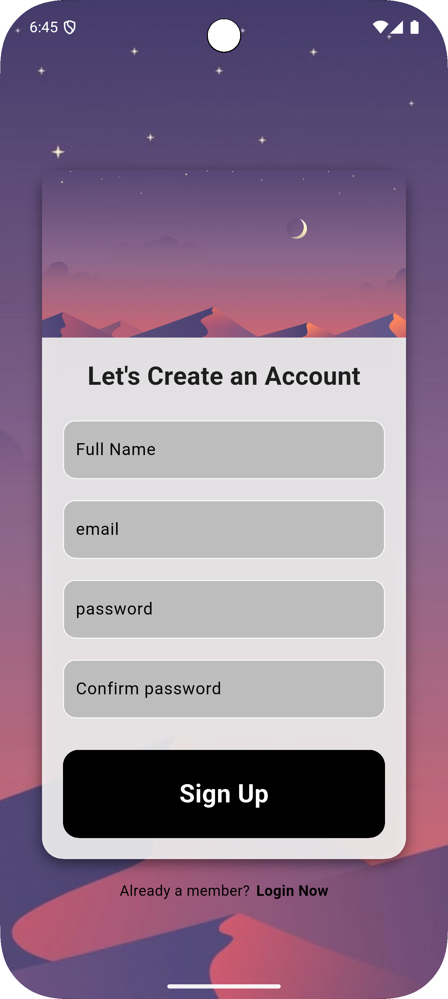
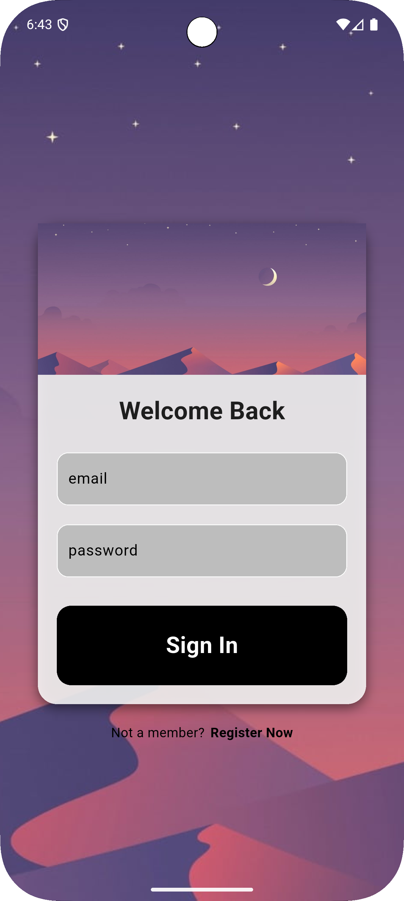
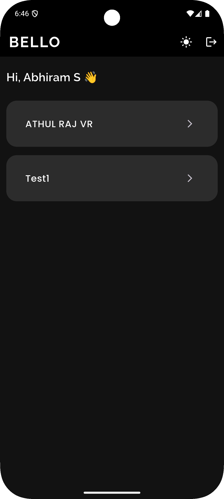
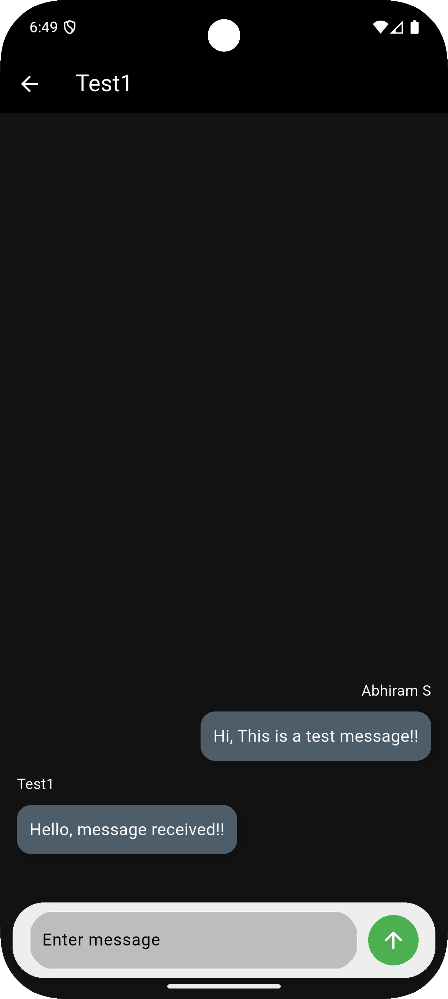

# 📱 Messenger (Demo)

A sleek and fully functional Flutter-based messaging app integrated with Firebase services.  
This repository is a **public showcase** with screenshots and APK access, while the complete source code remains private.

## ✨ Features

- 🔐 **User Authentication**
  - Firebase Email/Password login and registration
- 💬 **Real-time Chat**
  - Send and receive messages instantly using Firebase Firestore
- 🎨 **Light & Dark Mode**
  - Toggle between light and dark themes
- ✅ **Modern UI**
  - Clean, intuitive interface built with Flutter widgets
- ☁️ **Cloud-Hosted Backend**
  - Powered entirely by Firebase (Auth + Firestore)
- 📲 **APK for Testing**
  - Install and test the app on Android devices

## 📸 App Screenshots

| Register | Login |
|----------|-------|
|  |  |

| Home Page | Chat Page |
|-----------|-----------|
|  |  |

---

## 📦 Download APK
- You can download and test the latest version of the app here:

- [messenger v1.0.0](https://github.com/Abhiram086/messenger-demo/releases/download/v1.0.0/messenger-v1.0.0.apk)

## 🚀 How It Works

The app consists of the following core modules:

- **Authentication**: Uses Firebase Auth for secure user login/registration.
- **Chat Engine**: Messages are stored and synced in real-time via Firestore.
- **UI**: Flutter is used for building smooth, reactive UI components with theme support.
- **State Management**: The app uses `Provider` for managing user and chat state across widgets.

## 🛠 Built With

- [Flutter](https://flutter.dev/)
- [Firebase Authentication](https://firebase.google.com/products/auth)
- [Firebase Firestore](https://firebase.google.com/products/firestore)
- [Provider](https://pub.dev/packages/provider) – for app-wide state management

## 👨‍💻 Author

**Abhiram S**  
Feel free to connect with me on [GitHub](https://github.com/Abhiram086)

